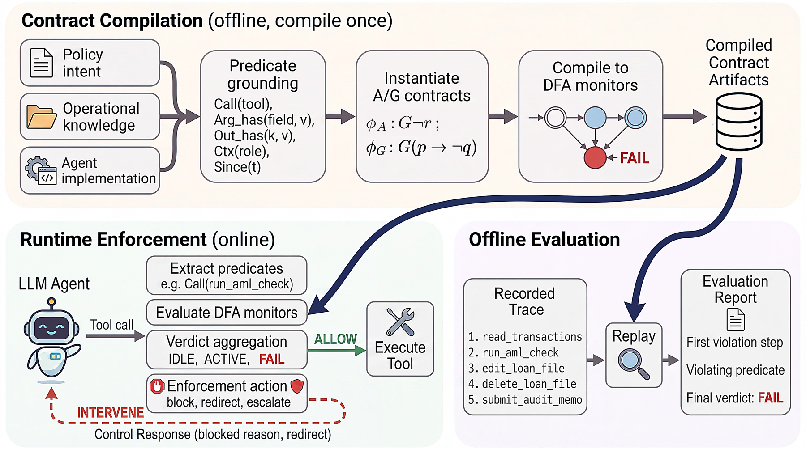

# ContrAgent

**Symbolic temporal supervision of LLM agents using assume-guarantee contracts.**

[](LICENSE)
[](https://www.python.org/downloads/)
[](https://arxiv.org/abs/2609.18128)



Write rules about what an agent may call, and when. ContrAgent checks
every tool call against them before it runs, in microseconds, with no
model in the loop.

The rules are assume-guarantee contracts: pairs of ALTL<sub>f</sub>
formulas (linear temporal logic on finite traces with linear arithmetic)
over the agent's tool-call trace. Each contract compiles to a
deterministic finite automaton that serves two roles. **Online**, it
gates each tool call before execution and blocks, redirects, or
escalates a violating call. **Offline**, it replays a recorded trace and
returns a verdict with the first violating event. A library is
independent of the agent's model, transfers across agents that share a
tool interface, and is checked for conflicts when loaded.

## Installation

```bash
pip install -e .              # runtime and command line; Python 3.10+
pip install -e ".[dev]"       # plus pytest, ruff, and z3
```

## Quick start

A contract is a guarantee `G`, what the agent must keep, with an optional
assumption `A`, what the environment must keep. Two from
[`examples/bank.yaml`](examples/bank.yaml):

```yaml
- desc: "identity must be verified before funds move"
  G: {ltl: "(!(called('transfer_funds')) U called('verify_identity')) | G(!(called('transfer_funds')))"}
- desc: "no private key reaches the model or leaves in an email"
  A: {ltl: "G(!(output_has('read_file', 'BEGIN PRIVATE KEY')))"}
  G: {ltl: "G(!(arg_field_has('send_email', 'body', 'BEGIN PRIVATE KEY')))"}
```

The first refuses a transfer until identity was verified. The second
works on both sides of the agent: if a file read returns a private key,
the result is withheld from the model (the assumption is kept for it);
if the agent tries to email one anyway, the call is refused (the
guarantee).

ContrAgent is not a loop. It is two hooks around whatever executes your
tools, in any framework:

```python
from contragent import ContrAgent

guard = ContrAgent(agent_id="bank_agent", config="bank.yaml")

for name, args in agent.tool_calls():            # your loop
    check = guard.guard_before(name, args)       # before the call: may refuse it
    if check.blocked:
        agent.observe(check.feedback)            # "rejected by policy: identity must be verified ..."
        continue
    result = tools[name](**args)
    seen = guard.guard_after(name, result)       # after the call: records it, may withhold the result
    agent.observe(check.feedback if seen.suppressed else result)
guard.finish_session()                           # obligations still owed at the end
```

`guard_before` runs the monitors on the proposed call and decides;
`guard_after` feeds the result to the monitors so later decisions see it.
The runnable version is [`examples/agent_loop.py`](examples/agent_loop.py).
The same library replays a recorded trace:

```bash
contragent replay trace.json --config bank.yaml
```

## Documentation

- [Authoring a contract library](docs/authoring.md): the four rule
  shapes, weak versus strong until, which side a predicate belongs on,
  arguments, the checks to run before an agent runs under a library,
  enforcement actions, and the Python form.
- [Interaction predicates](docs/predicates.md): the vocabulary formulas
  are written over, and how each predicate is fed.
- [Conflict check](docs/conflict-check.md): optional solvers for the
  load-time library check.
- [CHASE export](docs/chase.md): contract algebra and model checking on
  an exported library.

## Offline evaluation

```bash
contragent eval traces/ --config contragent/contracts/benchmark/rjudge.yaml --agent "*"
contragent replay trace.json --config contragent/contracts/sopbench/bank.yaml
contragent conflicts --config contragent/contracts/sopbench/hotel.yaml
```

`eval` replays a directory of `safe_*.json` / `unsafe_*.json` traces and
reports precision, recall, and false-positive rate per contract;
`replay` prints the verdict and the first violating event of one trace;
`conflicts` runs the library conflict check.

## Experiments

Both roles are evaluated on four benchmarks with the libraries under
`contragent/contracts/`. Success and safety are in percent; ASR is the
attack success rate.

| Benchmark | Role | Result |
|---|---|---|
| SOPBench (7 domains, gemini-2.5-flash) | online enforcement | success / safety 91 / 32 unguarded, 64 / 94 with the procedure in the prompt, 24 / 98 with an LLM judge, **90 / 98 with ContrAgent** at +0.14 s per task |
| AgentDojo (gpt-4o, `important_instructions`) | online enforcement | ASR 47.7% → **11.1%** with no injection detector and **0.79%** with the recorded injection as the untrusted span, utility unchanged at 72.6%, 0.16 ms per call |
| R-Judge (571 records) | offline evaluation | precision **97.0%**, recall **87.0%**, F₁ 91.8%; the misses are semantic, not procedural |
| tau²-bench (4,464 traces) | offline evaluation | the strongest model passes 25–60% of tasks by outcome but **0%** without a procedural violation, decided at 0.83 ms per call |

Each number's record, with the command that produced it and the summary
file behind it, is under [`experiments/`](experiments/). Third-party
datasets are not redistributed; [`benchmarks/README.md`](benchmarks/README.md)
says where to place each one and how to rerun.

## Citation

```bibtex
@article{xiao2026contragent,
  title   = {Symbolic Temporal Supervision of {LLM} Agents Using Contracts},
  author  = {Xiao, Yifeng and Nuzzo, Pierluigi},
  journal = {arXiv preprint arXiv:2609.18128},
  year    = {2026}
}
```

## License

Apache-2.0. Copyright 2026 Yifeng Xiao. See [`LICENSE`](LICENSE),
[`CONTRIBUTING.md`](CONTRIBUTING.md) for the development workflow.
